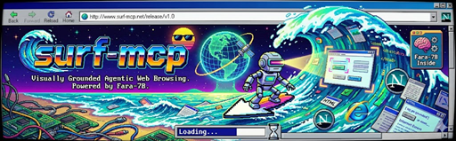
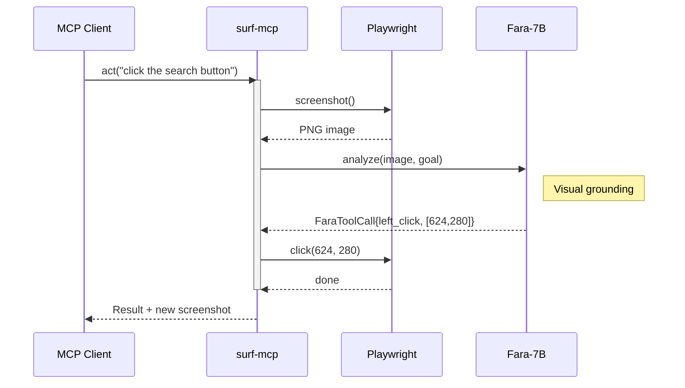

# Surf MCP

MCP server for visual browser automation via Fara.

## Overview

Surf provides browser automation through visual grounding - you describe what you see, and it clicks, types, and navigates based on that description. No CSS selectors, no DOM traversal, just natural language.

The core insight: an AI that can *see* the page doesn't need to parse HTML.

## Features

- **Visual grounding**: Click/type by natural language description ("the blue Submit button")
- **Direct Fara execution**: Fara decides the action, we execute it
- **Autonomous mode**: Multi-step goal completion with progress tracking
- **Multi-server LM Studio**: Auto-discovery and failover across GPU servers
- **Session persistence**: Storage state (cookies, localStorage) round-trips through tool calls
- **Security controls**: Domain allowlists, rate limiting, audit logging

## Security

**surf-mcp is designed for LOCAL use only** via stdio transport.

### Not Suitable For

- **Multi-tenant environments** - trust boundary is the machine
- **Untrusted networks** without SSH tunneling
- **Compliance-sensitive contexts** - no formal security audit
- **Untrusted MCP clients** - surf-mcp trusts its client completely

### Residual Risks

- No encryption at MCP protocol level
- LLM responses (Fara/Gemini) executed without verification
- Browser automation can click/type anything visible

### Remote Execution

Use SSH as the transport - surf-mcp sees normal stdio:

```json
{
  "mcpServers": {
    "surf-remote": {
      "command": "ssh",
      "args": ["-i", "~/.ssh/key", "user@gpu-box", "surf-mcp"]
    }
  }
}
```

See [SECURITY.md](SECURITY.md) for the full threat model and security controls.

## How It Works

Surf uses **Fara-7B** (Microsoft's agentic vision model) to understand web pages:



### Supported Actions

| Action | Description |
|--------|-------------|
| `left_click` | Click at coordinates |
| `double_click` | Double-click at coordinates |
| `type` | Type text (optionally at coordinates) |
| `scroll` | Scroll page up/down |
| `key` | Press keyboard keys |
| `visit_url` | Navigate to URL |
| `terminate` | Task complete signal (agent mode) |
| `wait` | Wait for page to load |
| `history_back` | Navigate back in browser history |

## Installation

```bash
# Install from source
pip install -e .

# Install Playwright browsers
playwright install chromium

# Optional: Install harness dependencies
pip install -e ".[harness]"
```

## Quick Start

### As MCP Server

Add to your MCP client configuration:

```json
{
  "mcpServers": {
    "surf": {
      "command": "surf-mcp"
    }
  }
}
```

### Docker

```bash
# Build the image
docker build -t surf-mcp .

# Run with LM Studio on host
docker run -it --rm \
  --add-host=host.docker.internal:host-gateway \
  -e LMSTUDIO_SERVERS="default=http://host.docker.internal:1234/v1" \
  surf-mcp

# Or use docker-compose
docker-compose up -d
```

### Fara Test Harness

Interactive UI for testing visual grounding:

```bash
cd tools/fara-harness
./run.sh    # Linux/Mac
run.bat     # Windows
```

See [tools/fara-harness/CHEATSHEET.md](tools/fara-harness/CHEATSHEET.md) for command reference.

## Usage Examples

### Browser Navigation with Visual Grounding

```python
# Create session
session = await mcp.call("session_create", {
    "drivers": {
        "web": {
            "type": "browser",
            "headless": False,
            "storage_state": saved_state  # Optional: restore cookies
        }
    }
})

# Navigate to page
await mcp.call("goto", {
    "session_id": session["session_id"],
    "driver": "web",
    "location": "https://example.com"
})

# Click element by description
await mcp.call("click", {
    "session_id": session["session_id"],
    "driver": "web",
    "description": "the blue Submit button"
})

# Direct Fara execution (recommended)
await mcp.call("act", {
    "session_id": session["session_id"],
    "driver": "web",
    "goal": "type 'hello world' into the search box"
})

# Autonomous multi-step execution
await mcp.call("act_autonomous", {
    "session_id": session["session_id"],
    "driver": "web",
    "goal": "log in with username 'demo' and password 'demo123'"
})

# Destroy session and capture storage_state
result = await mcp.call("session_destroy", {"session_id": session["session_id"]})
saved_state = result["summary"]["web"]["storage_state"]
```

## Configuration

### Environment Variables

```bash
# Multi-server LM Studio (visual grounding)
LMSTUDIO_SERVERS="rtx3090=http://localhost:1234/v1,rtx8000=http://192.168.1.100:1234/v1"
FARA_MODEL_IDS="microsoft_fara-7b,fara-7b-gguf,gao-zijian/fara-7b"
FARA_MAX_FAILURES=2
FARA_PROBE_TIMEOUT=2.0

# Confidence and Agent Mode
FARA_MIN_CONFIDENCE=0.7
FARA_CONFIDENCE_RETRIES=2
FARA_MAX_AGENT_STEPS=20
FARA_CONTEXT_SCREENSHOTS=3

# System prompt override (for advanced tuning)
# FARA_SYSTEM_PROMPT="Your custom prompt..."
# FARA_SYSTEM_PROMPT_FILE=/path/to/prompt.txt

# Alternative: Single OpenAI-compatible endpoint
OPENAI_API_KEY=lm-studio
OPENAI_BASE_URL=http://localhost:1234/v1
SURF_LLM_MODEL=microsoft_fara-7b

# Alternative: Gemini
GOOGLE_API_KEY=...
SURF_LLM_PROVIDER=gemini
SURF_LLM_MODEL=gemini-2.0-flash

# Browser defaults
SURF_BROWSER_HEADLESS=true
SURF_BROWSER_VIEWPORT_WIDTH=1920
SURF_BROWSER_VIEWPORT_HEIGHT=1080

# Session management
SURF_MAX_SESSIONS=10
SURF_SESSION_TIMEOUT_SECONDS=3600
```

### Multi-Server LM Studio

Surf supports multiple LM Studio instances for redundancy:

```bash
LMSTUDIO_SERVERS="gpu1=http://localhost:1234/v1,gpu2=http://192.168.1.50:1234/v1"
```

Behavior:
- **Auto-discovery**: Probes each server's `/v1/models` to find loaded Fara model
- **Prefer loaded**: Prioritizes servers with Fara already in VRAM
- **Failover**: Automatically retries on another server if one fails

### Autonomous Mode

`act_autonomous` runs Fara in a loop until the task completes or max steps is reached.

**Multi-screenshot context**: Each step includes the last 3 screenshots (configurable via `FARA_CONTEXT_SCREENSHOTS`) so Fara can see what changed between actions.

**Tips for best results**:

1. **Be specific**: "Click the blue Submit button" works better than "submit the form"
2. **Break down complex tasks**: Instead of "fill out the form and submit", try "fill in the name field with John, then the email with john@example.com"
3. **Increase max steps for complex flows**: Set `FARA_MAX_AGENT_STEPS=30` for multi-page workflows
4. **Watch for loops**: If Fara clicks the same element repeatedly (dropdown toggles), it may need more specific instructions

**Known limitations**:
- **CAPTCHAs and bot detection**: Sites with Cloudflare, reCAPTCHA, or similar protections will detect and block automated access. Modern CAPTCHAs analyze mouse movement patterns - Playwright's `click(x, y)` teleports the cursor without realistic motion paths, which is easily detected. This is a fundamental limitation of screenshot-based automation.
- Date picker dropdowns can be tricky - Fara may toggle instead of selecting a value
- Complex multi-dropdown widgets (month/day/year selects) may need manual intervention
- Very long forms may exceed the step limit

**System prompt tuning**: For advanced use cases, override the system prompt:

```bash
# File-based (recommended for multi-line prompts)
FARA_SYSTEM_PROMPT_FILE=/path/to/custom_prompt.txt

# Inline
FARA_SYSTEM_PROMPT="Your custom instructions..."
```

Priority: File > Inline > Default

## MCP Tools

### Session Lifecycle
| Tool | Description |
|------|-------------|
| `session_create` | Create browser session |
| `session_destroy` | Cleanup session, returns storage_state |
| `session_list` | List active sessions |

### Navigation
| Tool | Description |
|------|-------------|
| `goto` | Navigate to URL |
| `current` | Get current URL |
| `back` / `forward` | Navigate history |
| `history` | Get navigation history |

### Content
| Tool | Description |
|------|-------------|
| `list` | Extract page links |
| `read` | Read page content |
| `snapshot` | Capture screenshot |

### Visual Grounding
| Tool | Description |
|------|-------------|
| `locate` | Find element by description, return coordinates |
| `click` | Click element by description |
| `type` | Type into element by description |
| `scroll` | Scroll page up/down |
| `wait` | Wait for element or delay |
| `act` | Direct Fara execution - Fara decides the action |
| `act_autonomous` | Multi-step autonomous execution until task complete |

## Architecture

See [docs/ARCHITECTURE.md](docs/ARCHITECTURE.md) for detailed architecture documentation.

Design decisions are recorded in [docs/adr/](docs/adr/).

## Development

```bash
# Install dev dependencies
pip install -e ".[dev]"

# Run tests
pytest                    # All tests
pytest -m "not live"      # Skip LLM tests (for CI)
pytest -m live            # Only live LLM tests

# Type checking
mypy src/

# Linting
ruff check src/
```

## License

MIT
